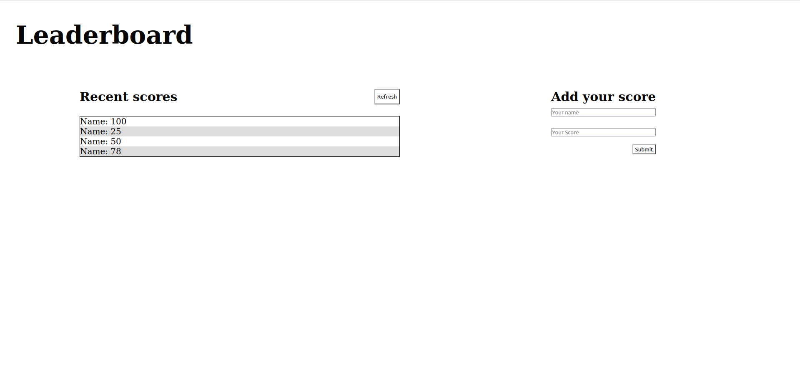

# Leaderboard Project

- The "Leaderboard project" 

## Built With

- HTML
- CSS
- javaScript
- webpack

To get a local copy up and running follow these simple example steps.
Run:
- `git clone git@github.com:JbirdL86/webpack-project.git`
- `cd webpack-project`
- `Install node_modules, run npm install and install the latest node version`
- `Install webpack package`
-  Open ./dist/index.html in browser

## Authors

👤 **Author**

- Github: [@githubhandle](https://github.com/JbirdL86)
- Twitter: [@twitterhandle](https://twitter.com/JuanLui06498455)
- Linkedin: [linkedin](https://www.linkedin.com/in/juan-luis-0551921aa/)

## 🤝 Contributing

Contributions, issues, and feature requests are welcome!

Feel free to check the [issues page](https://github.com/JbirdL86/leaderboard-project/issues).

## Show your support

Give a ⭐️ if you like this project!

## Acknowledgments

- Microverse
- Figma 

## 📝 License

This project is [MIT](./MIT.md) licensed.